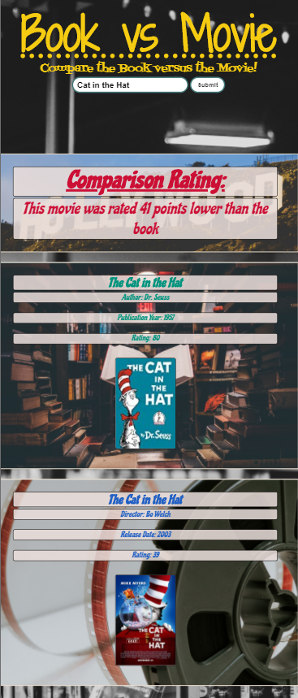

# Book vs Movie

## Contents
* [About](#about)
* [Technologies](#technologies)
* [Links](#links)
* [Contributors](#contributors)
* [Contact](#contact)
* [License](#license)

## Note!
Due to Goodreads discontinuing their API, this app is no longer fully functional

## About
Quick way to compare the audience rating of a movie with that of the book it's based on.\

## Technologies
* jQuery
* Ajax
* OMDB API (JSON)
* Goodreads API (XML)
* Bulma CSS Framework

## Links
[Site](https://theykay.github.io/book-vs-movie)\
[Repository](https://github.com/theykay/Book-vs-Movie)

## Contributors
* Kay Murray [theykay](https://github.com/theykay)
* Walter Guerrero [ReddPhoenix](https://github.com/ReddPhoenix)
* Corbin Jarmes [corbinjarmes](https://github.com/corbinjarmes)

## Contact
Github: [theykay](https://github.com/theykay)\
Email: [murraykyleb@gmail.com](mailto:murraykyleb@gmail.com)

## License
This project is covered under the [MIT](https://choosealicense.com/licenses/mit/) license